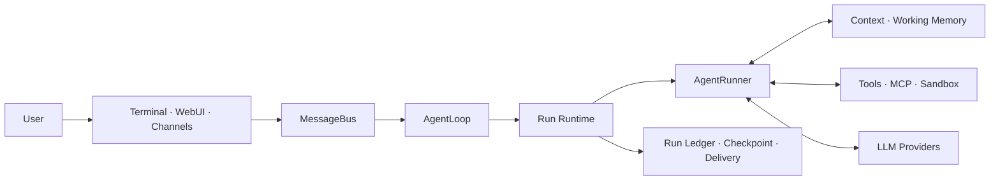
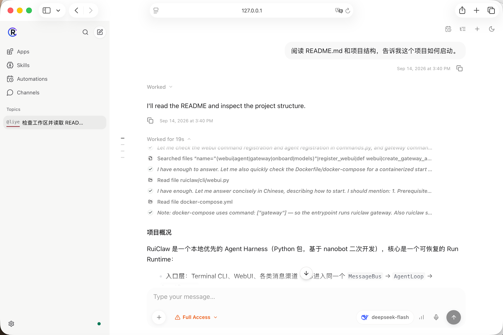
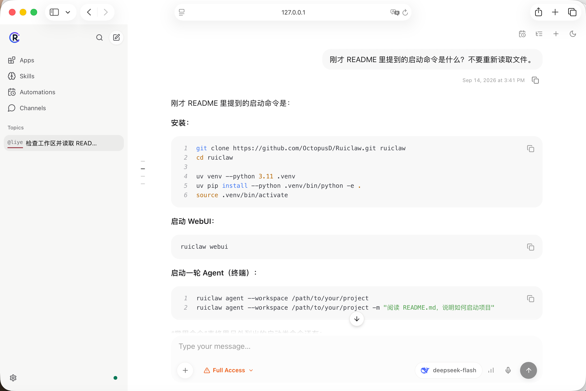

<div align="center">


### One recoverable Agent Runtime across every place you work.

在 Terminal、WebUI 与消息渠道中运行同一个工具型 Agent。入口可以不同，但一次执行的
Run、Context、工具边界、恢复状态与证据模型保持一致。

[快速开始](#从安装到第一轮-agent) · [核心能力](#ruiclaw-负责什么) · [运行检查](#查看-run-与恢复执行) · [评测](#可复核评测) · [中文](README.md)

</div>

---

RuiClaw 是一个本地优先的 Agent Harness，基于
[nanobot](https://github.com/HKUDS/nanobot) 开发。它保留 nanobot 的 Provider、工具、
消息总线与渠道生态，并为一次 Agent 执行补充统一的 Run Runtime：调度、上下文装配、
工具调用、检查点、恢复、投递与可查询证据均关联到同一个 Run。



## 从安装到第一轮 Agent

要求：Python 3.11+。修改 WebUI 时还需要 Node.js / npm 或 Bun。

```bash
git clone https://github.com/OctopusD/Ruiclaw.git ruiclaw
cd ruiclaw

uv venv --python 3.11 .venv
uv pip install --python .venv/bin/python -e .
source .venv/bin/activate
```

启动 WebUI：

```bash
ruiclaw webui
```

在 **Settings → Models** 配置 Provider、API Key 和模型，再选择工作区。也可以直接在终端
启动一轮 Agent：

```bash
ruiclaw agent --workspace /path/to/your/project
ruiclaw agent --workspace /path/to/your/project -m "阅读 README.md，说明如何启动项目"
```

首次运行会创建 RuiClaw 的本地配置。密钥与本地状态不应提交到仓库。

### WebUI 实际运行

下面展示 Agent 在 WebUI 中读取项目结构、调用文件工具并回答启动方式；同一次请求的
工具调用、Context 与结果均可通过 Run Inspector 继续查看。



同一会话中的追问会复用已确认的上下文，直接给出对应的安装与启动命令。



## RuiClaw 负责什么

| 目标 | RuiClaw 的实现 |
| --- | --- |
| 同一个 Agent 运行在多个入口 | Terminal、WebUI 和渠道消息都进入同一个 `AgentLoop` 与 Run 模型。 |
| 可恢复的执行 | Tool Call、工具完成和最终答案边界写入 Checkpoint；恢复会新建子 Run，并以 `parent_run_id` 保留因果关系。 |
| 可解释的上下文 | Context Ledger 记录 bootstrap、history、memory、skills 与 tool result 等来源及其 Token 统计，不保存完整 Prompt。 |
| 有边界的工具执行 | 已声明安全的只读工具可并行；写入和副作用工具顺序执行，并统一处理超时与取消。 |
| 可追踪的成本与结果 | Provider 用量、成本状态、工具调用、投递与失败原因写入 Run Ledger。未知费率会保持 `unknown`，不会伪造成本。 |
| 可控的记忆与演进 | Working Memory 用摘要和 SHA-256 新鲜度校验避免陈旧信息；Run 驱动的 Memory/Skill Review 按独立阈值批量复盘，策略候选 Evolver 仍需人工确认。 |

## 常用命令

| 目标 | 命令 |
| --- | --- |
| 启动交互式 Agent | `ruiclaw agent --workspace /path/to/project` |
| 执行单条请求 | `ruiclaw agent --workspace /path/to/project -m "..."` |
| 打开 WebUI | `ruiclaw webui` |
| 启动 Gateway | `ruiclaw gateway` |
| 查看最近的执行 | `ruiclaw runs list --workspace /path/to/project` |
| 查看一次执行详情 | `ruiclaw runs show <run_id> --workspace /path/to/project` |
| 查看自进化队列 | 对话中输入 `/evolve status` |
| 复盘已有 Memory/Skill 候选 | 对话中输入 `/evolve memory`、`/evolve skills` 或 `/evolve all` |
| 运行确定性 Harness 测试 | `ruiclaw bench run` |

## 查看 Run 与恢复执行

每个非临时 Agent 请求都会在工作区生成一个证据包：

```text
.ruiclaw/runs/<run_id>/
├── manifest.json     # 请求、状态、父 Run 与聚合指标
├── events.jsonl      # 有序事件流
└── report.json       # 工具、Context、成本和投递摘要
```

```bash
ruiclaw runs list --workspace /path/to/your/project
ruiclaw runs show <run_id> --workspace /path/to/your/project
```

Run Inspector 可查看状态、耗时、Token、成本状态、Context 来源峰值、工具调用和时间线。
Working Memory 保存在 `.ruiclaw/memory/`，由 Agent 维护，通常无需手动编辑。
自进化调度状态保存在 `.ruiclaw/evolution/state.json`；复盘达到 Memory/Skill 各自阈值后在
后台运行，并将输入 Run、模型/工具消耗和文件级变更继续写入 Run Ledger。复盘不修改模型权重，
也不会自动发布 Provider 或 Runtime 策略。

## 可复核评测

仓库内的 Bench 均为确定性的本地 Harness 测试，无需真实模型 API Key：

```bash
ruiclaw bench run
ruiclaw bench recovery
ruiclaw bench memory
ruiclaw bench tools
ruiclaw bench evolve
ruiclaw bench self-evolution
```

真实模型的小规模自进化 A/B 会产生 API 调用，需要显式选择 `live` 模式：

```bash
ruiclaw bench self-evolution --mode live --model-preset deepseek-flash
```

扩展到中等规模（每组 4 个学习任务、8 个 Holdout）时显式指定任务数和 seed：

```bash
ruiclaw bench self-evolution --mode live --model-preset deepseek-flash \
  --seed 1 --learning-tasks 4 --holdout-tasks 8
```

建议分别使用 `--seed 1`、`--seed 2`、`--seed 3` 跑三次；每次指定不同的
`--workspace-root` 或保留默认目录让下一次覆盖，最后比较三个 JSON 的均值和方差。

Live smoke 使用同版本 RuiClaw 的 Evolution-off/on 两组，以及互相独立的 Learning/Holdout
workspace 和 Session；Evolved 只把 Review Journal 声明的 Memory/Skill 变更复制给 Holdout，
Baseline 不复制学习阶段产生的任何文件。
结果默认写入 `benchmarks/results/ruiclaw-self-evolution-live-smoke-v1/`。它不会修改或自动发布
日常 workspace 中的 Memory/Skills；Gateway 日志和全局 usage 变化只作为信息记录，不参与门禁。

| 评测 | 已提交结果 | 证据 |
| --- | --- | --- |
| RuiClaw Bench v1 | 6/6 通过 | [`result.json`](benchmarks/results/ruiclaw-bench-v1/result.json) |
| Recovery Bench v1 | 3/3 通过，重复副作用 0 | [`result.json`](benchmarks/results/ruiclaw-recovery-v1/result.json) |
| Memory Bench v1 | 7/7 通过，Top-1 100%，陈旧摘要抑制率 100% | [`result.json`](benchmarks/results/ruiclaw-memory-v1/result.json) |
| Tool Governance v1 | 3/3 通过，读取微基准 2.00x | [`result.json`](benchmarks/results/ruiclaw-tool-governance-v1/result.json) |
| Evolver Lite v1 | Top-K 3 → 1，Context 字符减少 56.87%，仅建议人工复核 | [`comparison.md`](benchmarks/results/ruiclaw-evolver-v1/comparison.md) |
| Self-Evolution A/B v1 | 隔离工作区中验证双队列、Combined Review、Memory/Skill 注入与无回归门禁 | [`comparison.md`](benchmarks/results/ruiclaw-self-evolution-v1/comparison.md) |
| Live Self-Evolution Smoke v1 | DeepSeek Flash；学习型 Holdout 0/2 → 2/2，总体 50% → 100%，Safety/Regression 无回退 | [`comparison.md`](benchmarks/results/ruiclaw-self-evolution-live-smoke-v1/comparison.md) |
| Live Self-Evolution v1（3 seeds） | 4/8 学习任务、8 个 Holdout/seed；总体 58.3% → 95.8%，3/3 门禁通过 | [`seed-1`](benchmarks/results/ruiclaw-self-evolution-live-v1/seed-1/comparison.json)、[`seed-2`](benchmarks/results/ruiclaw-self-evolution-live-v1/seed-2/comparison.json)、[`seed-3`](benchmarks/results/ruiclaw-self-evolution-live-v1/seed-3/comparison.json) |

这些结果用于验证 Runtime 机制、回归和证据链。`ruiclaw-evolver-v1` 只有 2 个封闭集任务，
并标记为 `insufficient_small_holdout`；`ruiclaw-self-evolution-v1` 使用脚本化 Reviewer，验证的是
自进化管线而不是真实模型学习质量。它们不代表真实模型 Coding 能力、生产 SLA 或统计显著性。
Live smoke 只有 2 个学习任务和 4 个 Holdout，只有实际运行并提交结果后才应报告其中的模型指标。
当前 Live 结果为单次 `n=4` Holdout：学习型通过率 0/2 → 2/2，Holdout 总 Token
224,586 → 30,030（-86.6%），P95 延迟 21,599 ms → 17,834 ms；Evolution Review
实际只修改了 `memory/MEMORY.md`，因此不能将该结果表述为 Skill 文件自动生成或统计稳定的通用能力提升。
扩展结果使用 3 个 seed、每组 4 个学习任务和 8 个 Holdout：总体通过率为
`14/24（58.3%）→ 23/24（95.8%）`，Memory 为 `0/6 → 6/6`，程序性知识为
`2/6 → 5/6`，Safety/Regression 均为 `6/6`。三次 Review 均关联 `4/4` 学习 Run，
并成功复制一个 Memory 文件和一个 Skill 文件；这仍是小规模实验，不能替代更大任务集。

### 外部评测：Youtu-Agent / WebWalkerQA

RuiClaw 通过适配器接入 [Youtu-Agent](https://github.com/TencentCloudADP/youtu-agent) 的
`WebWalkerQA_15` 流程：Youtu 负责数据集、Judge 与任务正确性判定；RuiClaw 负责真实 Agent
运行和 Run Ledger。下表是单并发、15 题的小样本对照，原始 nanobot 与 RuiClaw 使用同一份本地模型配置。

| Agent | 正确率 | 可审计运行证据 |
| --- | ---: | --- |
| 原始 nanobot baseline | 11/15（73.3%） | 无 Run Ledger |
| RuiClaw | 13/15（86.7%） | 15/15 运行保留 Run Ledger |

这次对照中 RuiClaw 多答对 2 题（+13.4pt）。样本量仅 15，且部分结果由 LLM Judge 判定，
因此该结果用于验证真实 Agent 管线和审计闭环，不代表通用能力排名或统计显著性结论。工具、Token
与时延的完整统计口径及 artifact 说明见 [`ruiclaw.md`](ruiclaw.md)。

## 状态、安全与发布边界

| 范围 | 默认位置 |
| --- | --- |
| RuiClaw Run 与 Working Memory | 工作区 `.ruiclaw/` |
| ruiclaw 兼容配置与会话 | `~/.ruiclaw/` |
| 已提交的 Bench 证据 | `benchmarks/results/` |

`.ruiclaw/`、本地配置、会话、密钥和临时 Benchmark 工作区默认被 `.gitignore` 排除。
`pico/` 是本地参考项目，不属于 RuiClaw 发布内容。推送前请运行 `git status`，确认没有暂存
`.env`、API Key 或工作区私有数据。

当前版本侧重本地可恢复执行、可观测性和可复核评测；不宣称已具备生产级自动化发布或大规模
真实模型效果。

## 开发与验证

```bash
ruff check ruiclaw/
.venv/bin/pytest tests/ -q
cd webui && npm run build && npm run test
```

更多设计取舍与阶段记录见 [`.agent/ruiclaw-design.md`](.agent/ruiclaw-design.md)；运行时模型的
项目概览见 [`ruiclaw.md`](ruiclaw.md)。

## 致谢与许可证

RuiClaw 基于 nanobot 二次开发，并保留其 MIT 许可证和版权声明。RuiClaw 与 nanobot
项目并无官方隶属关系；上游能力和原始实现的版权归 ruiclaw contributors 所有。详见
[LICENSE](LICENSE) 和 [THIRD_PARTY_NOTICES.md](THIRD_PARTY_NOTICES.md)。
